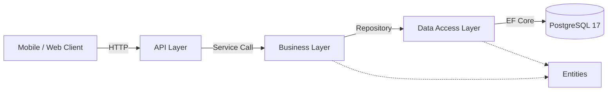
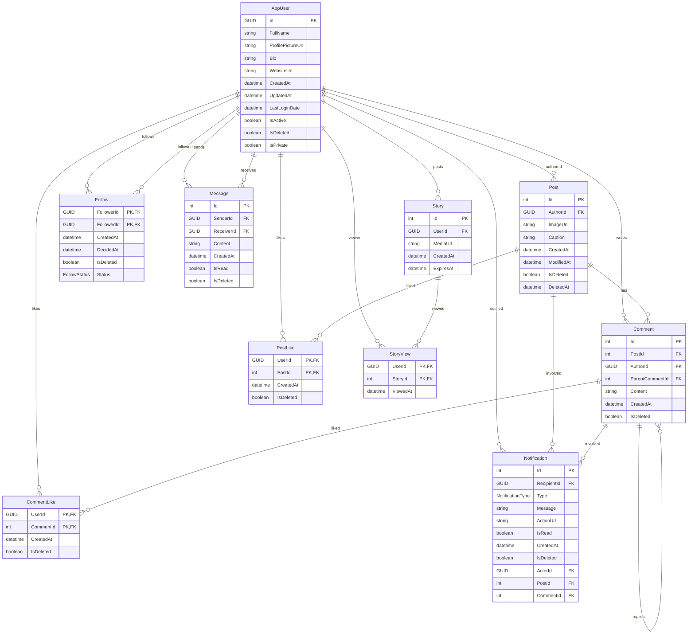

# Instagram Clone – Backend API

> *An ASP.NET Core backend that powers an Instagram-style social media app: posts, stories, likes, follows, DMs, and notifications.*

---

## Table of Contents

1. [Overview](#overview)
2. [Features](#features)
3. [Tech Stack](#tech-stack)
4. [Architecture](#architecture)
5. [API Reference](#api-reference)

---

## Overview

This project is the **backend service** for an Instagram-like application. It exposes a RESTful API that lets clients:

* register & authenticate users,
* publish posts and stories with media uploads,
* like, comment, and follow other users,
* exchange direct messages,
* receive real-time notifications.

Everything is built with **.NET 9** and follows a clean, layered architecture so it can grow pain-free.

---

## Features

* **Layered solution structure** – `API → Business → Data → Entities`.
* **Identity**-based authentication with JWT & refresh tokens.
* **Follow, like, comment, story, message** domains implemented.
* **Soft-delete & audit fields** on all entities.
* **OpenAPI / Swagger** UI generated automatically.
* **Mermaid ER diagram** committed for instant DB insight.

---

## Tech Stack

| Layer           | Library / Tool                         | Purpose                              |
|-----------------|----------------------------------------|--------------------------------------|
| **API**         | ASP.NET Core 9 Web API                 | Controllers & middleware (authN/Z)   |
| **Business**    | AutoMapper                             | Application services, DTO↔entity map |
| **Data Access** | Entity Framework Core 9 · Tools/Design | Repositories, migrations             |
| **Entities**    | C# Class Library                       | Domain models (AppUser, Post, …)     |
| **Database**    | PostgreSQL 17                          | Persistent storage                   |

---

## Architecture

### Layer Diagram

### Entity-Relationship Diagram

---

## API Reference

| Method | Endpoint                  | Description                    |
| ------ | ------------------------- | ------------------------------ |
| POST   | `/api/v1/auth/register`   | Register a new account         |
| POST   | `/api/v1/auth/login`      | Obtain JWT access & refresh    |
| GET    | `/api/v1/users`           | List users                     |
| GET    | `/api/v1/users/{id}`      | Retrieve user profile          |
| POST   | `/api/v1/posts`           | Create a post                  |
| GET    | `/api/v1/posts/{id}`      | Get a single post              |
| POST   | `/api/v1/posts/{id}/like` | Like a post                    |
| ...    | ...                       | *(see Swagger for all routes)* |

Full, always-up-to-date docs live at `/swagger`.
