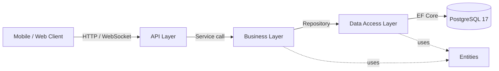
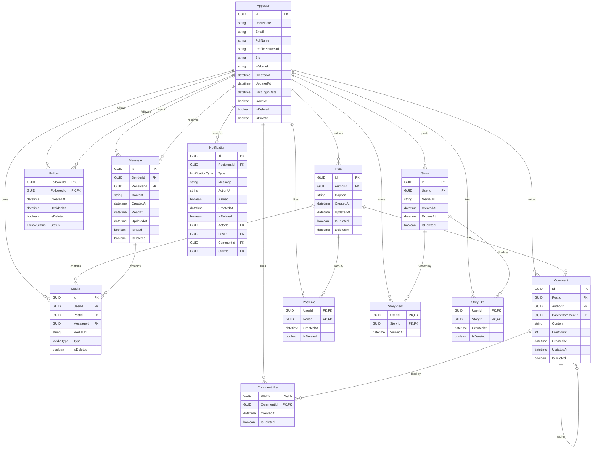

# Social Media Platform – Backend API


> *An ASP.NET Core 9 backend that powers a modern social platform: posts with media, stories, likes, comments, follows with privacy, direct messages (real-time), and notifications — backed by a full unit / integration / end-to-end test pyramid.*

---

## Table of Contents

1. [Overview](#overview)
2. [Features](#features)
3. [Tech Stack](#tech-stack)
4. [Architecture](#architecture)
5. [Database Schema](#database-schema)
6. [Testing](#testing)
7. [API Reference](#api-reference)
8. [Running Locally](#running-locally)

---

## Overview

This is the **backend service** for a social platform. It exposes a RESTful API (plus a SignalR hub for real-time chat) that lets clients:

* register & authenticate users with JWT,
* publish posts and 24-hour stories with media uploads,
* like, comment (with nested replies), and follow other users,
* respect **account privacy** (public vs. private, follow requests, accepted-only feeds),
* exchange direct messages in real time (SignalR: presence, typing, read receipts),
* receive notifications for likes, comments, follows, and messages.

Built with **.NET 9** in a clean, layered architecture, with a strong emphasis on **testability** — see the [Testing](#testing) section, which is the heart of this project.

---

## Features

* **Layered solution** – `API → Business → Data → Entities`.
* **JWT authentication** with ASP.NET Core Identity.
* **Privacy model** – private accounts, pending/accepted/rejected follow requests, and privacy-aware feeds.
* **Soft-delete** – removed, expired, or deactivated content disappears from the app but is retained in the database.
* **Consistent error responses** – meaningful HTTP status codes (`404 / 403 / 409 / 400`) with structured JSON error bodies.
* **Real-time chat** via SignalR (`/hubs/chat`).
* **Scalar API Reference UI** generated automatically at `/scalar/v1`.
* **117 automated tests** across the full pyramid, run in CI against a real PostgreSQL.

> **Planned / next up:** refresh tokens, Redis feed caching, a background job to purge expired stories, S3-compatible media storage (MinIO), and structured logging.

---

## Tech Stack

| Layer            | Library / Tool                          | Purpose                                    |
|------------------|-----------------------------------------|--------------------------------------------|
| **API**          | ASP.NET Core 9 Web API, SignalR         | Controllers, middleware, real-time hub     |
| **Auth**         | ASP.NET Core Identity, JWT Bearer       | Registration, login, token validation      |
| **Business**     | AutoMapper                              | Application services, DTO ↔ entity mapping |
| **Data Access**  | Entity Framework Core 9, Npgsql         | Repositories, migrations                   |
| **Entities**     | C# class library                        | Domain models                              |
| **Database**     | PostgreSQL 17                           | Persistent storage                         |
| **Cache / RT**   | Redis (StackExchange.Redis)             | SignalR backplane / caching (planned)      |
| **Testing**      | xUnit, Moq, FluentAssertions, Testcontainers-style local Postgres, `WebApplicationFactory` | Unit / integration / E2E |
| **Docs**         | Scalar + Swagger / OpenAPI              | Interactive API reference                  |
| **CI**           | GitHub Actions                          | Build + test on every push/PR              |

---

## Architecture


```mermaid
graph LR
  UI[Mobile / Web Client] -->|HTTP / WebSocket| API[API Layer]
  API -->|Service call| BL[Business Layer]
  BL -->|Repository| DAL[Data Access Layer]
  DAL -->|EF Core| DB[(PostgreSQL 17)]
  ENT[Entities]
  BL -.uses.-> ENT
  DAL -.uses.-> ENT
```

---

## Database Schema

All primary keys are `GUID`. Join entities (`PostLike`, `CommentLike`, `Follow`, `StoryView`, `StoryLike`) use composite keys. Content entities carry soft-delete and audit fields, so removed, expired, or deactivated data is hidden from the app while remaining in the database.


```mermaid
erDiagram
    AppUser {
        GUID     Id PK
        string   UserName
        string   Email
        string   FullName
        string   ProfilePictureUrl
        string   Bio
        string   WebsiteUrl
        datetime CreatedAt
        datetime UpdatedAt
        datetime LastLoginDate
        boolean  IsActive
        boolean  IsDeleted
        boolean  IsPrivate
    }

    Post {
        GUID     Id PK
        GUID     AuthorId FK
        string   Caption
        datetime CreatedAt
        datetime UpdatedAt
        boolean  IsDeleted
        datetime DeletedAt
    }

    Media {
        GUID     Id PK
        GUID     UserId FK
        GUID     PostId FK
        GUID     MessageId FK
        string   MediaUrl
        MediaType Type
        boolean  IsDeleted
    }

    Comment {
        GUID     Id PK
        GUID     PostId FK
        GUID     AuthorId FK
        GUID     ParentCommentId FK
        string   Content
        int      LikeCount
        datetime CreatedAt
        datetime UpdatedAt
        boolean  IsDeleted
    }

    PostLike {
        GUID     UserId PK, FK
        GUID     PostId PK, FK
        datetime CreatedAt
        boolean  IsDeleted
    }

    CommentLike {
        GUID     UserId PK, FK
        GUID     CommentId PK, FK
        datetime CreatedAt
        boolean  IsDeleted
    }

    Follow {
        GUID     FollowerId PK, FK
        GUID     FollowedId PK, FK
        datetime CreatedAt
        datetime DecidedAt
        boolean  IsDeleted
        FollowStatus Status
    }

    Message {
        GUID     Id PK
        GUID     SenderId FK
        GUID     ReceiverId FK
        string   Content
        datetime CreatedAt
        datetime ReadAt
        datetime UpdatedAt
        boolean  IsRead
        boolean  IsDeleted
    }

    Notification {
        GUID     Id PK
        GUID     RecipientId FK
        NotificationType Type
        string   Message
        string   ActionUrl
        boolean  IsRead
        datetime CreatedAt
        boolean  IsDeleted
        GUID     ActorId FK
        GUID     PostId FK
        GUID     CommentId FK
        GUID     StoryId FK
    }

    Story {
        GUID     Id PK
        GUID     UserId FK
        string   MediaUrl
        datetime CreatedAt
        datetime ExpiresAt
        boolean  IsDeleted
    }

    StoryView {
        GUID     UserId PK, FK
        GUID     StoryId PK, FK
        datetime ViewedAt
    }

    StoryLike {
        GUID     UserId PK, FK
        GUID     StoryId PK, FK
        datetime CreatedAt
        boolean  IsDeleted
    }

    AppUser ||--o{ Post         : authors
    AppUser ||--o{ Comment      : writes
    AppUser ||--o{ PostLike     : likes
    AppUser ||--o{ CommentLike  : likes
    AppUser ||--o{ Follow       : follows
    Follow  }o--|| AppUser      : followed
    AppUser ||--o{ Message      : sends
    AppUser ||--o{ Message      : receives
    AppUser ||--o{ Notification : receives
    AppUser ||--o{ Story        : posts
    AppUser ||--o{ StoryView    : views
    AppUser ||--o{ StoryLike    : likes
    AppUser ||--o{ Media        : owns

    Post    ||--o{ Comment      : has
    Post    ||--o{ PostLike     : liked-by
    Post    ||--o{ Media        : contains

    Comment ||--o{ Comment      : replies
    Comment ||--o{ CommentLike  : liked-by

    Message ||--o{ Media        : contains

    Story   ||--o{ StoryView    : viewed-by
    Story   ||--o{ StoryLike    : liked-by
```

> Notifications carry optional `ActorId / PostId / CommentId / StoryId` references (all `ON DELETE SET NULL`), so a notification survives even if the thing it points to is removed.

---

## Testing

Testing is a first-class concern here, structured as the classic **test pyramid** and run in CI on every push against a real PostgreSQL.

| Layer            | Count | What it verifies                                                                 | How                                                            |
|------------------|-------|----------------------------------------------------------------------------------|---------------------------------------------------------------|
| **Unit**         | 81    | One service in isolation — branches, guards, state transitions                   | xUnit + Moq (strict) + FluentAssertions; collaborators mocked |
| **Integration**  | 27    | Real service + repositories + database: persistence, privacy rules, transactions | A real local PostgreSQL, a fresh throwaway DB per test        |
| **E2E**          | 9     | The whole app over HTTP: routing, model binding, JWT middleware, JSON contract   | `WebApplicationFactory<Program>` + `HttpClient`               |
| **Total**        | **117** |                                                                                |                                                               |

**Test layout** (`SocialMediaPlatform.Tests/`):

```
UnitTests/          + UnitTestSupport/        # mocked collaborators
IntegrationTests/   + IntegrationSupport/     # real Postgres, per-test database
E2eTests/           + E2eSupport/             # real app hosted in-memory
```

**Bugs these tests caught (and fixed):** a profile update that never persisted, a case-sensitive user search (`LIKE` vs `ILIKE` on Postgres), a migration chain that had drifted from the model, a global exception middleware that was never registered, and a notification endpoint broken by a stale DTO type. Integration and E2E tests exist precisely because unit tests with mocks cannot see any of these.

Run the whole suite:

```bash
dotnet test
```

> Integration and E2E tests need a reachable PostgreSQL. They default to `localhost:5432` (user `postgres`), overridable via `TEST_PG_HOST / TEST_PG_PORT / TEST_PG_USER / TEST_PG_PASSWORD`. CI provides one as a service container.

---

## API Reference

Routes are `/api/[controller]`; the action is expressed by the HTTP verb (REST style), not the URL.

| Method | Endpoint                                   | Description                         |
| ------ | ------------------------------------------ | ----------------------------------- |
| POST   | `/api/auth/register`                       | Register a new account (returns JWT) |
| POST   | `/api/auth/login`                          | Log in (returns JWT)                |
| POST   | `/api/posts`                               | Create a post (`multipart/form-data`) |
| GET    | `/api/posts/feed`                          | Feed: own + accepted-follows' posts |
| GET    | `/api/posts/{postId}`                      | Get a single post                   |
| POST   | `/api/posts/{postId}/like`                 | Like a post                         |
| POST   | `/api/follows/{targetUserId}`              | Follow / request to follow          |
| POST   | `/api/follows/requests/{requesterId}/accept` | Accept a follow request           |
| GET    | `/api/notifications`                       | List notifications                  |
| ...    | ...                                        | *(see Scalar for every route)*      |

Full, always-current docs live at **`/scalar/v1`**.

---

## Running Locally

### With Docker Compose (API + PostgreSQL + Redis)

```bash
docker compose up --build
```

- **API** → http://localhost:5005/scalar/v1
- **PostgreSQL** → `localhost:5433` (host) / `db:5432` (inside the compose network)

### Environment (`.env`)

```env
DB_CONNECTION_STRING=Host=db;Port=5432;Database=socialmedia;Username=postgres;Password=postgres

JWT_KEY=change-this-to-a-long-random-dev-only-key-of-32-plus-chars
JWT_ISSUER=SocialMediaPlatformAPI
JWT_AUDIENCE=SocialMediaPlatformApp
JWT_EXPIRE_MINUTES=120

ASPNETCORE_ENVIRONMENT=Development

POSTGRES_USER=postgres
POSTGRES_PASSWORD=postgres
POSTGRES_DB=socialmedia

REDIS_CONNECTION=redis:6379,abortConnect=false
```

### Useful commands

```bash
docker compose down -v          # stop and wipe volumes (fresh DB next time)
docker compose logs -f          # tail logs
dotnet ef migrations add <Name> --project SocialMediaPlatform.Data --startup-project SocialMediaPlatform.API
```
